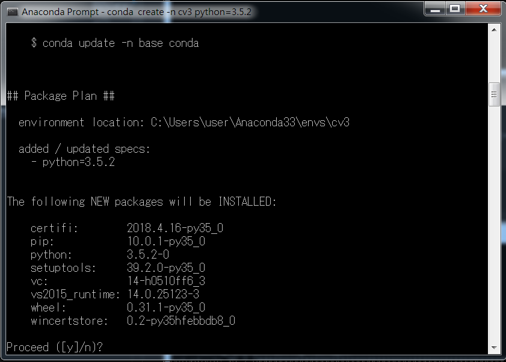
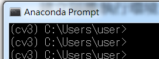
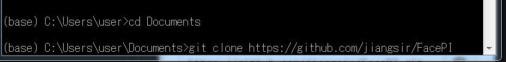
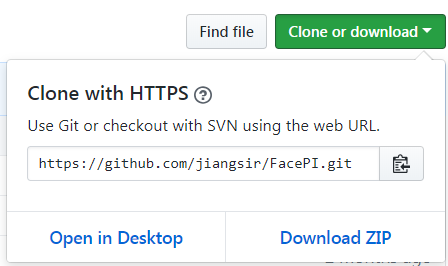
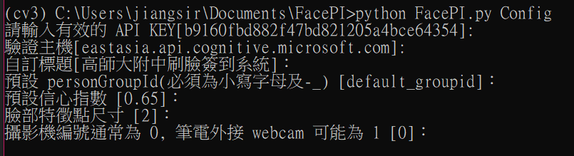
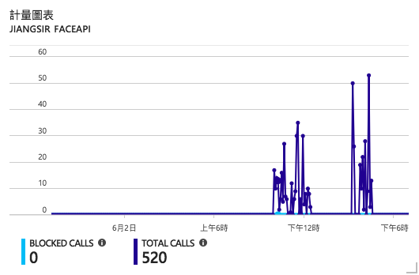
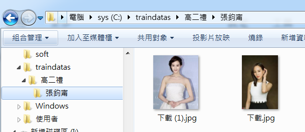
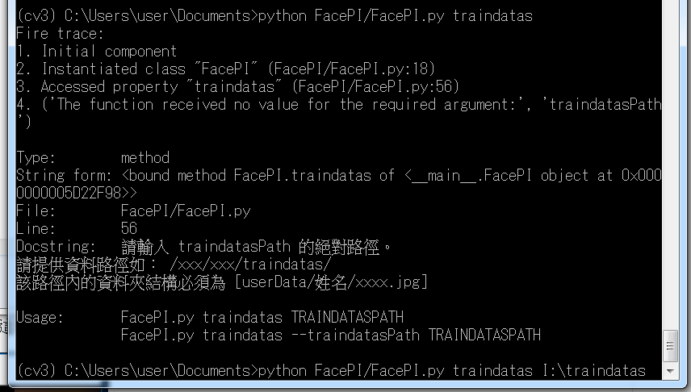

FacePI 刷臉簽到系統 for Windows
====================

2017 年可說是各種刷臉應用的爆發的一年，各種應用目不暇給。微軟也在 2016 年提出「微軟認知服務」，裡面就包含了一組 API ，叫做 Face API，專門提供臉部辨識服務，FacePI 就是利用這個 Face API 設計成一個刷臉簽到應用。

在這裡要先做一些名詞解釋，因為中文裡面這幾個詞有點容易搞混。
* 「臉部偵測(Face Detection)」:偵測影像中的一或多張人臉，並取得影像臉部位置所在的臉部矩形及臉部屬性，該屬性內含以機器學習為基礎的臉部特徵預測。可用的臉部屬性功能 包括：年齡、表情、性別、姿勢、微笑及鬍子，以及影像中每張臉部的 27 個地標。
* 「臉部驗證(Face Verification)」:檢查兩張臉部是屬於同一個人的可能性。API 會傳回信心分數，顯示兩張臉部是屬於同一個人的可能性。
* 「表情辨識」：臉部 API 現在與表情辨識整合，並傳回影像中每個臉部之一組表情的信心分數，例如生氣、藐視、厭惡、恐懼、快樂、不表意見、憂傷及驚奇。這些表情已知可跨文化普遍地與特定臉部表情溝通。
* 「臉部辨識(Face Identification)」:臉部 API 讓您可搜尋、識別和比對您私人存放庫中多達 1 百萬人的臉部。

2018年5月 FacePI 已經跨平台至 Windows 上囉，已經在 Windows 7 與 Windows 10 實測可行。移植的原因主要是樹莓派的運算效能不夠高，速度慢。因此，若專案不需要使用到 GPIO 控制外部設備的話，安裝在 Windows 上可以找到較好的機器設備運行。

點擊播放影片

## 搭建環境

### Anaconda
首先必須下載 anaconda ，請選擇 Python3 的版本。

安裝完成後，在程式集->anaconda prompt 進入文字介面。

### 建立隔離執行環境
為了避免與原先環境互相衝突，最好的方式就是建立一個隔離的執行環境。接著要安裝什麼都按 [y] 安裝。
    
    conda create -n cv3 python=3.5.2

點擊 y 繼續安裝所需套件

接著進入這個環境

    conda activate cv3
    
    舊版的 anaconda 可改用
    activate cv3

在這個隔離環境內安裝 OpenCV

    conda install -c https://conda.anaconda.org/menpo opencv3

如果要脫離這個隔離環境回到 (base)

    conda deactivate

如果要刪除整個隔離環境的話：

    conda remove -n cv3 --all

要看看目前已經存在的環境有哪些：

    conda info -e

進入到 (cv3) 這個環境當中，安裝必要的套件：

    pip install fire 
    pip install Pillow 
    pip install pypinyin
    pip install django

## 開始安裝 FacePI 本體。

若您已經安裝 git 環境，則可以直接下以下指令即可。

    git clone https://github.com/jiangsir/FacePI

若沒有 git 指令的話，就直接到 github 把程式抓回來，點擊 Download ZIP。

    https://github.com/jiangsir/FacePI

進入 FacePI 放置的路徑，比如「文件」資料夾

    cd /Users/user/Documents
    # 此處請依據自己的環境修改。 
    

## 執行
執行 FacePI.py, FacePI 主要是一個文字介面程式：

    cd /Users/user/Documents
    # 此處請依據自己的環境修改。 
    python FacePI/FacePI.py

    Config: 列出 Config.json 設定。
    Signin: 進行簽到！
    Identify: 用網路 URL 或本地圖片進行辨識。,
    Train: 用 3 連拍訓練一個新人

    Usage:       FacePI.py 
                FacePI.py Config
                FacePI.py Identify
                FacePI.py Signin
                FacePI.py Train

首先，請務必先進行系統設定，指令如下：

    python FacePI/FacePI.py Config

點擊 ENTER 不輸入任何值，代表使用預設值。最重要的是更換 API_KEY 的值。預設的 API_KEY 是公用性質，隨時可能被修改或刪除。

## 申請一個 API_KEY

最主要的設定就是 API_KEY 請至微軟網站申請一個 API_KEY。
進入到微軟官方頁面 [試用辨識服務](https://azure.microsoft.com/zh-tw/try/cognitive-services/?api=face-api)，我們要的是 臉部 API 點擊取得 API 金鑰。然後你就可以獲得 30 天的試用，總共 30000 筆查詢，每分鐘上限 20 筆。對於實驗來說夠用了。但如果要實際使用，每一個月要重新來一次也真是夠煩的。
因此，比較好的作法是，申請 Azure 帳號，一申請就送你 200 美金的用量，也足以做一個小型應用了，並且 API_KEY 也不會過期。至於用量同樣有每分鐘上限 20 筆，每月 30000 筆查詢的用量，若真的不夠，就可以在後台「儀表板」改為付費模式。每 1000 筆查詢大約會產生 1 美元的費用。
為了推廣人工智慧應用，諸位軟體大咖們真的是拚了。

### 訓練
訓練有 3 種方式：
1. 「訓練」三連拍：用來「訓練」將來要進行辨識的人。

    python FacePI/FacePI.py Train <userData> <姓名>

比如: 可以用 <userData> 來標示人員的分類。

    python FacePI/FacePI.py Train 高師大附中國一仁 王寶釧

2. 訓練相片檔:

    python FacePI/FacePI.py traindatas C:\traindatas

traindatas 下的檔案結構如下:
如: C:\traindatas\高二禮\張鈞甯\ <放置數個相片檔>

請注意，訓練相片檔內只可以有一個人，否則系統不知道哪一個是張鈞甯

進行訓練

3. 在「簽到」過程中，若發現系統不認識這個人或者認錯了，即可點擊 "a" 按鍵進行學習。

### 簽到
最後，進行簽到。

    python FacePI/FacePI.py Signin

即可依照畫面指示進行操作。

## 系統更新
本系統仍持續發展中，因此需要注意是否有新版提供使用，並及時更新。

    # 刪除原程式
    rm -rf FacePI
    or 
    rmdir /s/q FacePI

    # 重新取得
    git clone https://github.com/jiangsir/FacePI

## 結合資料庫,並顯示在網頁上

### 首先安裝資料庫
以 windows 使用者來說，最簡單的方式是安裝 XAMPP
進入管理資料庫

    http://127.0.0.1/phpmyadmin
設定好預設帳號密碼:

比如: 

    帳號: root
    密碼: DBPASSWORD

在資料庫內建立一個資料庫　facepi
簽到開始後，資料表系統會自動建立

### 安裝 django 網頁框架
    conda activate cv3
    pip install django

    輸入 python 進入 Python 互動介面
    >>> import django
    >>> django.get_version()
    '2.1'
    檢查是否安裝成功, 並顯示版本
    >>> exit()

    python FacePI/website/manage.py runserver
    也可以指定 port 號
    python FacePI/website/manage.py runserver 0.0.0.0:9000

請記得啟動 mysql, 在 windows 中則可安裝 xampp 方便管理

進入網頁: http://127.0.0.1:8000/FacePIapp/

### 修改設定讓外部電腦可以連入

進入 /FacePI/website/website/settings.py 裡修改, 注意不要漏掉 ", "
    
    ALLOWED_HOSTS = ['*',]

存檔並回到 runserver 的視窗 Ctrl-C 結束
再重新啟動 server

    python FacePI/website/manage.py runserver

