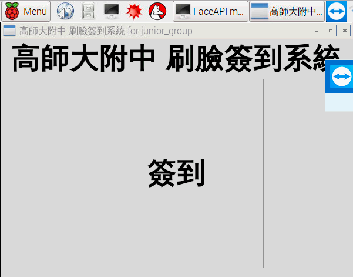
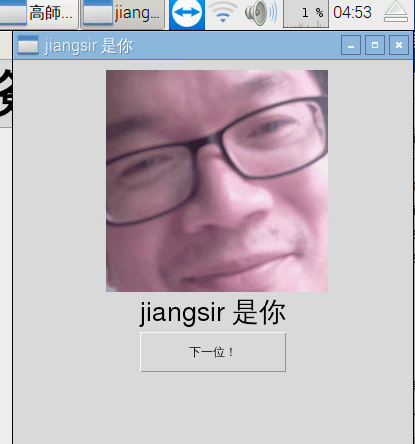

FacePI 讓樹莓派變身刷臉報到系統
====================
> 本專案僅作為技術驗證使用，若要自行運用，則仍須自行修改程式結構，以符合自身所需。
>

實測影片：

[](https://youtu.be/tQDK2j6lsCY)


2017 年可說是各種刷臉應用的爆發的一年，各種應用目不暇給。微軟也在 2016 年提出「微軟認知服務」，裡面就包含了一組 API ，叫做 Face API，專門提供臉部辨識服務，FacePI 就是利用這個 Face API 將它建構在樹莓派上，做成一個刷臉報到應用。

在這裡要先做一些名詞解釋，因為中文裡面這幾個詞有點容易搞混。
* 「臉部偵測(Face Detection)」:這是最簡單的一種應用，一般數位相機裡面就都可以看得到，就是直接把畫面中有人臉的地方用框框定位出來。
* 「臉部校驗(Face Verification)」:則是可以拿來比對一張圖片裡的人跟另一張圖片裡的人臉是否是同一人？因此得到的結果為“是”或"否"。
* 「臉部辨識(Face Identification)」:則是更進一步的找出圖片中的人是誰？

因為是微軟的服務，準備好你塵封已久的 hotmail 帳號準備去註冊一個服務吧！

首先進入到微軟官方頁面 [試用辨識服務](https://azure.microsoft.com/zh-tw/try/cognitive-services/?api=face-api)，我們要的是 臉部 API 點擊取得 API 金鑰。然後你就可以獲得30 天的試用，總共 30000 筆查詢，每分鐘上限 20 筆。對於實驗來說夠用了。如果真的想用在更大量的環境下，則需要申請 Azure 帳號，一申請就送你 200 美金的用量，也足以做一個小型應用了。為了推廣人工智慧應用，諸位軟體大咖們真的是拚了。

接下來你就會獲得兩項資訊：端點以及金鑰，在稍後程式呼叫服務的過程中都會用到。

[說明手冊](https://docs.microsoft.com/zh-tw/azure/cognitive-services/face/overview) 有詳細的說明，介紹這個 Face API 要如何使用。不過我們只對他的範例程式感興趣。因此底下的所有程式都是依據 [Face API reference](https://westus.dev.cognitive.microsoft.com/docs/services/563879b61984550e40cbbe8d/operations/563879b61984550f30395236) 改寫成我們在樹莓派上所想要呈現的樣子。

這裡先說明一下幾個名詞之間的關係，有助於各位後面使用服務時快速掌握他們之間的相關關係。
* Face： 就是 ... 嗯... 臉。
* Face List: 就是一群臉。
* Person: 一個 person 可以加入好幾個臉
* Person Group: 自訂一個人群，在人群裡面可以加入多個 person

Face API 整體的基本流程如下：

* 先建立一個 Person Group 然後獲得一個 personGroupId 
* 在這個 Person Group 裡面建立一個 Person 然後獲得一個 personId
* 接下來針對 Person Group 內的一個 person 放入訓練圖片。
* 訓練圖片放入之後，針對一個 Person Group 來做訓練。
* 查看 Person Group 的狀況，可以知道訓練是否有成功。
* 準備一張照片來辨識是否是剛剛所訓練的 Person Face.
    * 照片必須先經過 Detect 然後獲得一個 faceid, 
    * 用這個 faceid 到一個 personGroupId 內辨識是否同一個人。
    * 設定信心門檻，預設 0.5。進行完畢就會回傳符合的 candidates


接下來分別將這些動作用 Face API 的呼叫來替代，這當中包含了很多組不同的 API 呼叫，但基本用法大致都相同，因此僅就一個 Face Identity API 看一個典型的呼叫的程式碼寫法。
一個典型的呼叫大致會是如底下程式：

```python
def identify(faceids, personGroupId):
    print("開始辨識。")
    headers = {
        # Request headers
        'Content-Type': 'application/json',
        'Ocp-Apim-Subscription-Key': api_key,
    }

    params = urllib.parse.urlencode({})

    requestbody = '''{
        "personGroupId": "''' + personGroupId + '''",
        "faceIds":''' + str(faceids) + ''',
        "maxNumOfCandidatesReturned":1,
        "confidenceThreshold": 0.5
    }'''

    try:
        conn = http.client.HTTPSConnection(host)
        conn.request("POST", "/face/v1.0/identify?%s" % params, requestbody,
                     headers)
        response = conn.getresponse()
        data = response.read()
        #print(data)
        facejson = json.loads(str(data, 'UTF-8'))
        #print(facejson)
        conn.close()
        return facejson
    except Exception as e:
        print("[Errno {0}] {1}".format(e.errno, e.strerror))
        sys.exit()

```

首先用 def 定義一個函數，名叫 Identify。

### request headers
    Content-Type (optional)
    string
    Media type of the body sent to the API.
    Ocp-Apim-Subscription-Key
    string
    Subscription key which provides access to this API. Found in your Cognitive Services accounts.

先指定 headers 內含兩項元素 Content-Type 以及 Ocp-Apim-Subscription-Key 。Ocp-Apim-Subscription-Key 這裡就是你說取得的 API 金鑰。基本上往後的每個 API 呼叫 headers 的部分都是如此，大同小異。

### request params
然後要指定 params 請看 reference 這個 API 並沒有用到 params 因此就不須修改維持 `params = urllib.parse.urlencode({})` 即可。

### request body
request body 是一個 json 格式的字串。有兩個必要的欄位 faceIds, personGroupId

Fields |Type | Description 
--|--|--
faceIds|Array| 給定一個 array 裡面可以至多10個 faceId,就是我想要辨識的人臉圖片，將這個圖片餵給 Face Dectection 這個 API 就可以獲得 faceId。
personGroupId|String|要先在 [Person Group - Create a Person Group](https://westus.dev.cognitive.microsoft.com/docs/services/563879b61984550e40cbbe8d/operations/563879b61984550f30395244) 建立一個「人群」

```python
    requestbody = '''{
        "personGroupId": "''' + personGroupId + '''",
        "faceIds":''' + str(faceids) + ''',
        "maxNumOfCandidatesReturned":1,
        "confidenceThreshold": 0.5
    }'''

```

完成 web api 呼叫之後，系統會回傳相對應得結果。`Response 200` 就是正確的結果了。

Fields|Type|Description 
--|--|--
faceId|String| 告訴你回傳的是哪一個 faceId
candidates|Array|回傳一組「候選人」並標示他的 personId, 以及「信心指數」，預設是超過 0.5 就可以大致認定。
personId|String|這個「候選人」person 的 personId
confidence|	Number|	信心指數從 0 ~ 1

樹莓派上的準備工作
===

由於我們要在樹莓派上安裝，因此需要有一些準備工作。
* 配置鍵盤：請先修改鍵盤配置。

        sudo raspi-config
        Interfacing Options -> Keyboard Layout -> 將 UK 改成 US

* 啟用相機：請準備一個「CSI相機模組」，並正確安裝好，請在樹莓派上安裝好 Raspbian 然後啟用相機

        sudo raspi-config
        Interfacing Options -> P1 Camera  設定啟用


* 安裝軟體：

        安裝 webcam 程式
        sudo apt-get install fswebcom
        安裝幾個中文字型
        sudo apt-get install fonts-wqy-microhei fonts-wqy-zenhei xfonts-wqy
        安裝中文輸入法
        sudo apt-get install scim scim-tables-zh scim-chewing scim-gtk-immodule im-switch


接下來測試相機模組是否正常拍照。

        raspistill -o test.jpg

成功的話會出現 test.jpg 這個檔案。

接下來下載程式

        git clone https://github.com/jiangsir/FacePI

修改設定檔：

        nano FacePI/Config.json

```json
{
    "api_key": "<您的 Key>",
    "host": "westcentralus.api.cognitive.microsoft.com",
    "personGroupId": "<自訂的 personGroupId>",
    "title" : "<自訂的 title>"
}
```

* api_key: 就是您在微軟網站獲得的 API 金鑰。
* host: 就是「端點」。
* personGroupId: 可以自訂，若不存在會自動建立，可以將不同的人分群處理。
* title: 則會出現在主畫面的標題。


執行主畫面：

        python3 FacePI/MainGUI.py

實際畫面截圖：




